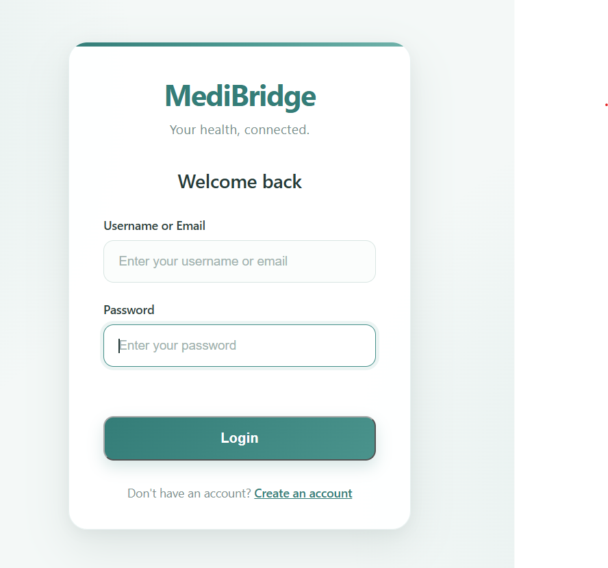
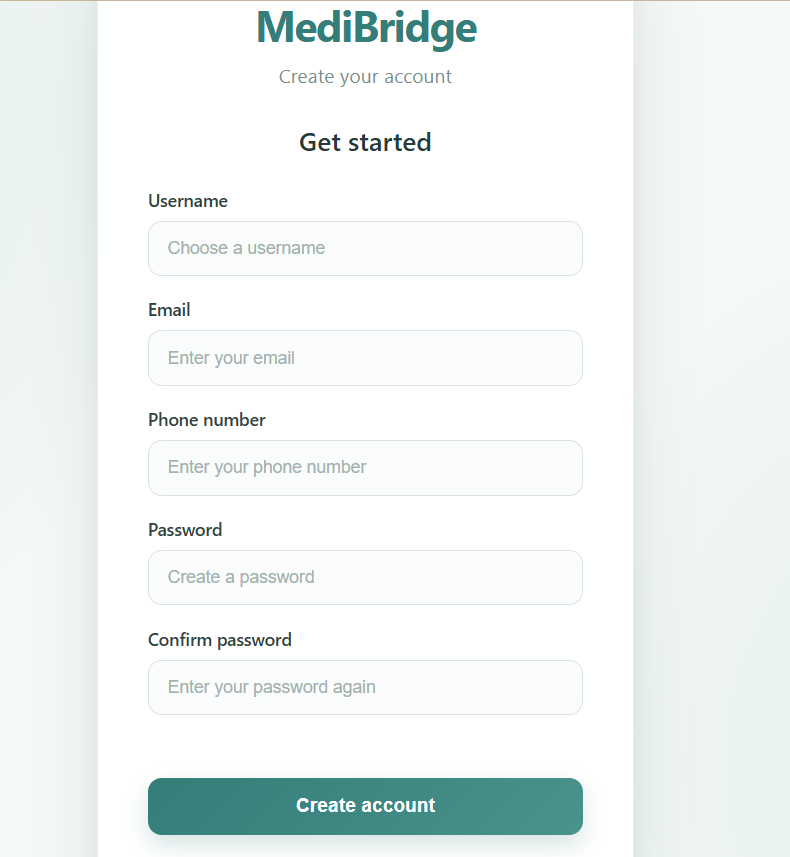
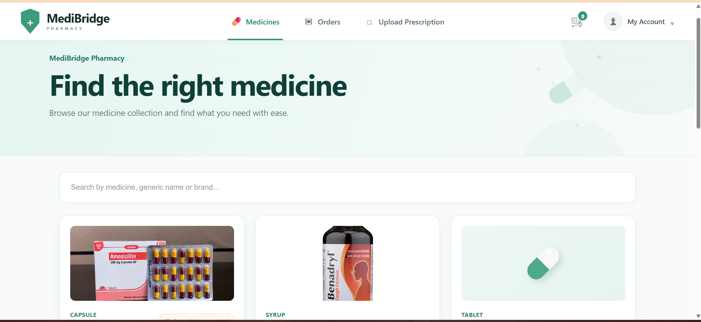
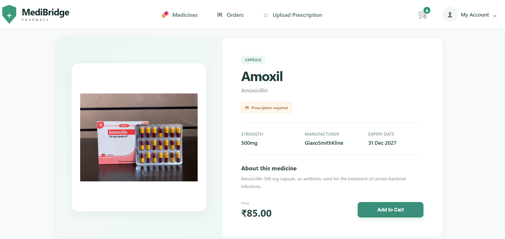
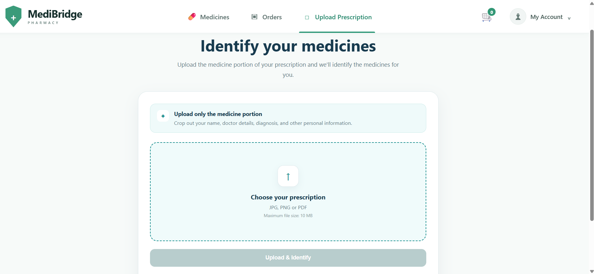
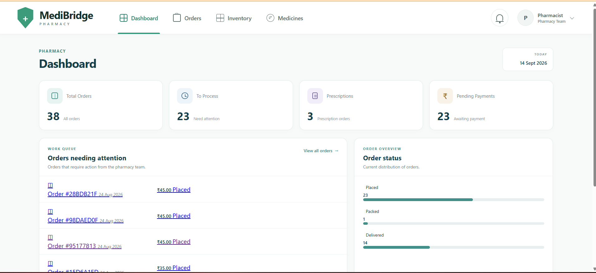
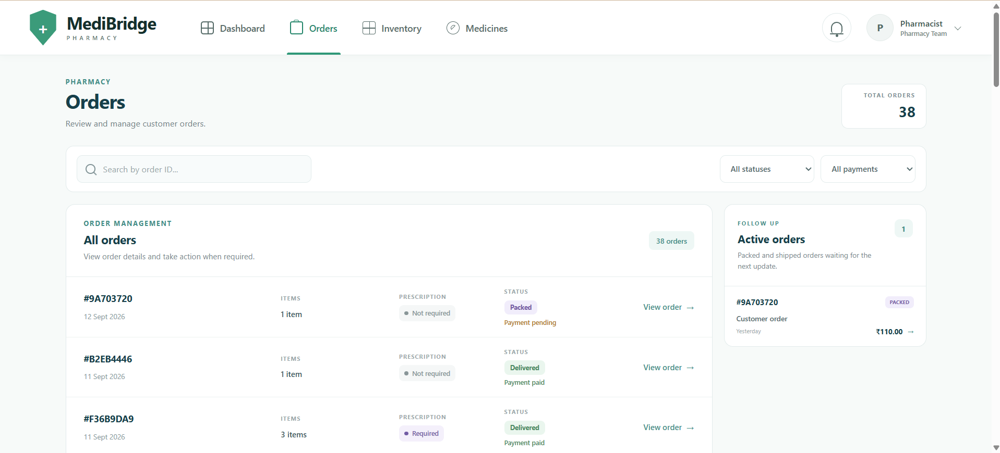

# 🏥 MediBridge

<p align="center">
  <strong>Full-Stack Online Pharmacy Management Platform</strong>
</p>

<p align="center">
  A digital pharmacy platform that connects customers and pharmacists through medicine ordering, prescription management, payments, inventory, and order processing.
</p>

---

## 🌿 About the Project

**MediBridge** is a full-stack online pharmacy management platform built with **Django, Django REST Framework, PostgreSQL, HTML, CSS, and JavaScript**.

The platform provides a complete medicine ordering experience for customers while giving pharmacists a dedicated dashboard to manage pharmacy operations.

Customers can browse medicines, search for products, view medicine details, add medicines to their cart, upload prescriptions, place orders, make payments, and track their orders.

Pharmacists can manage medicines and inventory, review prescriptions, process customer orders, update order statuses, and receive notifications about important pharmacy activities.

---

# ✨ Features

## 👤 Customer

### 🔐 Authentication

* User registration
* Login and logout
* JWT authentication
* Role-based access control
* Protected pages

### 💊 Medicine

* Browse medicines
* Search medicines
* View medicine details
* View medicine images
* Medicine categories
* Medicine availability

### 🛒 Shopping Cart

* Add medicines to cart
* Update medicine quantity
* Remove medicines
* View cart
* Calculate cart total

### 📋 Prescription

* Upload prescriptions
* Prescription-based medicine ordering
* AI-assisted prescription processing
* Extract medicine information from prescriptions
* Select extracted medicines for ordering

### 💳 Checkout & Payment

* Checkout system
* Razorpay online payment
* Cash on Delivery
* Payment verification
* Payment status tracking
* Retry failed payments

### 📦 Orders

* Place orders
* View order history
* View order details
* View active orders
* Track order status
* View payment status

### 🔔 Notifications

* Order-related notifications
* Important account and order updates

### 📧 Email

* Order placed email
* Order delivered email

---

# 👨‍⚕️ Pharmacist

MediBridge provides a dedicated pharmacist dashboard for managing pharmacy operations.

### 📊 Dashboard

* Pharmacy overview
* Active orders
* Order management
* Inventory access
* Medicine management
* Notifications

### 📦 Order Management

Pharmacists can:

* View customer orders
* View order details
* Review ordered medicines
* Process orders
* Update order status

### 📋 Prescription Verification

Pharmacists can:

* View prescriptions attached to orders
* Review uploaded prescriptions
* Verify prescriptions
* Reject prescriptions
* Add pharmacist notes

A prescription-based order **cannot be processed until the pharmacist verifies the prescription**.

### 💊 Medicine Management

* View medicines
* Manage medicine information
* Monitor medicine availability

### 📦 Inventory

* View inventory
* Monitor stock levels
* Manage stock
* Identify low-stock medicines

Medicines with **10 or fewer available units** are treated as low stock.

### 🔔 Notifications

Pharmacists receive notifications for:

* New orders
* Low-stock medicines

### 👤 Profile

* View pharmacist profile
* Logout

---

# 🔄 How MediBridge Works

## Customer Workflow

```text
Register / Login
      ↓
Browse Medicines
      ↓
View Medicine Details
      ↓
Add Medicines to Cart
      ↓
Upload Prescription (if required)
      ↓
AI Prescription Processing
      ↓
Select Medicines
      ↓
Checkout
      ↓
Choose Payment Method
      ↓
Place Order
      ↓
Track Order
```

## Pharmacist Workflow

```text
Pharmacist Login
      ↓
Dashboard
      ↓
View New Order
      ↓
Check Prescription
      ↓
Verify Prescription
      ↓
Check Medicine Stock
      ↓
Process Order
      ↓
Pack Order
      ↓
Ship Order
      ↓
Mark as Delivered
```

---

# 📋 Prescription Workflow

MediBridge includes an AI-assisted prescription workflow.

```text
Upload Prescription
        ↓
Prescription Processing
        ↓
AI Analysis
        ↓
Medicine Information Extraction
        ↓
Customer Selects Medicines
        ↓
Add Medicines to Cart
        ↓
Checkout
        ↓
Pharmacist Reviews Prescription
        ↓
Prescription Verified
        ↓
Order Processing
```

The pharmacist verification step ensures that prescription-based orders are reviewed before they are processed.

---

# 📦 Order Status

Orders move through:

```text
PLACED
   ↓
PROCESSING
   ↓
PACKED
   ↓
SHIPPED
   ↓
DELIVERED
```

Orders can also be:

```text
CANCELLED
```

---

# 💳 Payment

MediBridge supports two payment methods:

### Razorpay

Customers can complete online payments through Razorpay.

The system verifies the payment before updating the order payment status.

### Cash on Delivery

Customers can also choose Cash on Delivery.

### Payment Status

```text
PENDING
PAID
FAILED
```

Failed online payments can be retried from the order flow.

---

# 🔔 Notification System

MediBridge provides notifications for important pharmacy activities.

### New Order

When a customer places an order, the pharmacist receives a notification.

### Low Stock

When a medicine reaches the low-stock threshold, the pharmacist receives a notification.

Notifications provide quick access to the relevant section of the pharmacist dashboard.

---

# 📧 Email Notifications

MediBridge includes email notifications for important order events.

### Order Placed

```text
Customer places order
        ↓
Order created
        ↓
Order confirmation email
```

### Order Delivered

```text
Order marked as delivered
        ↓
Delivery confirmation email
```

---

# 🛡️ Role-Based Access

MediBridge supports three user roles:

| Role             | Access                                                 |
| ---------------- | ------------------------------------------------------ |
| 👤 Customer      | Medicines, Cart, Checkout, Prescriptions, Orders       |
| 👨‍⚕️ Pharmacist | Dashboard, Orders, Prescriptions, Medicines, Inventory |
| 👑 Admin         | Django administration and system management            |

Role-based permissions prevent users from accessing functionality that does not belong to their role.

---

# 🏗️ Architecture

MediBridge follows a modular Django architecture.

```text
                    ┌─────────────────┐
                    │    Frontend     │
                    │   HTML/CSS/JS   │
                    └────────┬────────┘
                             │
                             ▼
                    ┌─────────────────┐
                    │ Django Backend  │
                    │      + DRF      │
                    └────────┬────────┘
                             │
            ┌────────────────┼────────────────┐
            │                │                │
            ▼                ▼                ▼
       PostgreSQL        External APIs      Services
                           │
                  ┌────────┼────────┐
                  │        │        │
                  ▼        ▼        ▼
               Gemini   Razorpay   Gmail
```

---
# 📂 Project Structure

```text
MediBridge/
│
├── accounts/
├── ai_engine/
├── addresses/
├── cart/
├── common/
├── medicine/
├── notifications/
├── orders/
├── pages/
├── prescriptions/
│
├── config/
│   ├── settings.py
│   ├── urls.py
│   ├── wsgi.py
│   └── ...
│
├── static/
├── templates/
│
├── manage.py
├── requirements.txt
├── .gitignore
└── README.md
```

---

# 🔌 REST API

The backend APIs are organized under:

```text
/api/v1/
```

Main API modules:

```text
/api/v1/auth/
/api/v1/medicine/
/api/v1/prescriptions/
/api/v1/cart/
/api/v1/orders/
```

### Authentication

Handles user authentication and JWT authorization.

### Medicine

Handles medicine listing, searching, filtering, and medicine details.

### Prescriptions

Handles prescription upload, prescription details, and AI prescription processing.

### Cart

Handles adding, updating, removing, and clearing cart items.

### Orders

Handles order creation, order processing, payment verification, and order status updates.

---

# 🔐 Authentication

MediBridge uses JWT authentication through Django REST Framework and Simple JWT.

Authenticated API requests use:

```text
Authorization: Bearer <access_token>
```

Role-based permissions protect pharmacist functionality from unauthorized access.

---

# 🤖 AI Integration

MediBridge integrates **Google Gemini** for AI-assisted prescription processing.

The system processes uploaded prescription information and extracts medicine-related data to assist customers during the ordering process.

---

# 🗄️ Database

MediBridge uses **PostgreSQL** as its relational database.

The database stores information related to:

* Users
* Medicines
* Categories
* Inventory
* Prescriptions
* Cart items
* Orders
* Addresses
* Notifications
* Payment information

---

# 🛠️ Tech Stack

## Backend

* Python
* Django
* Django REST Framework
* Simple JWT
* Django Filters

## Frontend

* HTML5
* CSS3
* JavaScript

## Database

* PostgreSQL

## Integrations

* Google Gemini
* Razorpay
* Gmail SMTP

## Tools

* Git
* GitHub
* Postman
* VS Code

---

# ⚙️ Installation

## 1. Clone the repository

```bash
git clone https://github.com/saha-tithi/MediBridge.git
```

## 2. Navigate to the project

```bash
cd MediBridge
```

## 3. Create a virtual environment

```bash
python -m venv venv
```

## 4. Activate the virtual environment

### Windows

```bash
venv\Scripts\activate
```

## 5. Install dependencies

```bash
pip install -r requirements.txt
```

## 6. Configure environment variables

Create a `.env` file in the project root.

Example:

```env
SECRET_KEY=your_secret_key
DEBUG=True

DB_NAME=your_database_name
DB_USER=your_database_user
DB_PASSWORD=your_database_password
DB_HOST=localhost
DB_PORT=5432

EMAIL_HOST=smtp.gmail.com
EMAIL_PORT=587
EMAIL_USE_TLS=True
EMAIL_HOST_USER=your_email
EMAIL_HOST_PASSWORD=your_app_password
DEFAULT_FROM_EMAIL=your_email

RAZORPAY_KEY_ID=your_razorpay_key
RAZORPAY_SECRET=your_razorpay_secret

GEMINI_API_KEY=your_gemini_api_key
```

> ⚠️ Never commit `.env`, passwords, API keys, or other secrets to GitHub.

## 7. Run migrations

```bash
python manage.py migrate
```

## 8. Create an admin user

```bash
python manage.py createsuperuser
```

## 9. Start the development server

```bash
python manage.py runserver
```

Open:

```text
http://127.0.0.1:8000/
```

---

# 📸 Screenshots

Screenshots of the MediBridge application will be added here.

### 🔐 Login

<p align="center">
  
</p>

### 📝 Registration

<p align="center">
  
</p>
### 💊 Medicine Listing

<p align="center">
  
</p>

### 💊 Medicine Details

<p align="center">
  
</p>

### 🛒 Upload Prescription

<p align="center">
  
</p>


### 👨‍⚕️ Pharmacist Dashboard

<p align="center">
  
</p>

### 📦 Pharmacist Order

<p align="center">
  
</p>

---

# 👩‍💻 Author

## Tithi Saha

**MCA Student | Full-Stack Developer**

Built with ❤️ using **Django, Django REST Framework, PostgreSQL, HTML, CSS & JavaScript**.

---

<p align="center">
  ⭐ If you like this project, consider giving the repository a star!
</p>
